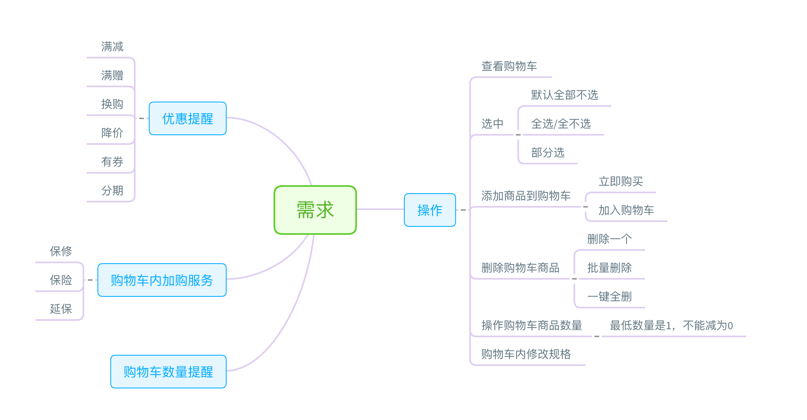
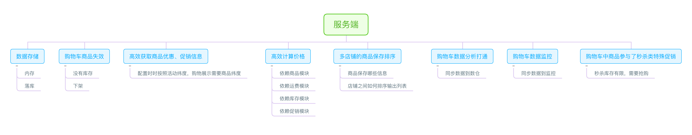
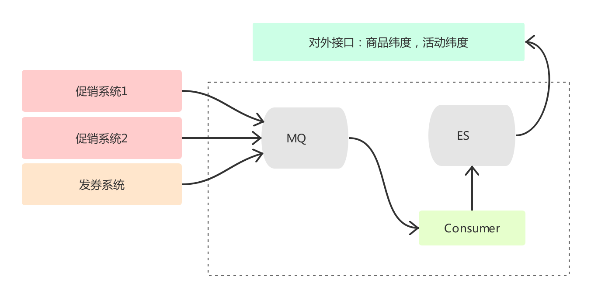

由于不同的商业模式对于购物车的需求是不一样的。为了后续设计理解上的统一我们对购物车的场景做一些界定。

我们这里设计的购物车是按照淘宝、京东等主流多租户模式设计的。

# 用户看到的功能

我们先来定义一下在用户侧用户操作购物车的功能有哪些？

接下来对用户侧的几个需求进行一些讨论，首先对于购物车的 **选中** 能力，淘宝的产品选中状态是保存在客户端的，并且默认不选中，刷新、重新打开APP状态会消失；京东、苏宁这一类是保存在服务端，会记录用户选中状态。针对这两种情况各有优劣。

**保存客户端：**

1. 性能，选中/不选中的逻辑直接放在本地做，减少网络请求
2. 体验，多端不能同步，但是购物车相对来说更像是一个收藏夹，每次用户自己选择也无可厚非
3. 计算，价格计算时需要上传本地选中商品（也可以本地计算）

**保存服务端：**

1. 性能，每次操作选中都需要调用服务端，而该操作可能很频繁
2. 体验，多端同步状态，记录历史状态
3. 计算，服务端可获取数据，请求时无须上传额外数据

针对上面的分析，我个人更倾向于服务端保存状态。因此我们的购物车也会选中该种方式。

其次对于 **购物车内加购服务** 能力，主要是买的一些产品提供的附加产品。逻辑上是买了A才可以购买它对应的服务（虚拟商品）。所以这会在后端做一个绑定关系。虚拟商品不可以单独销售。除了前面说的商品创建时需要做绑定，在购物车中的关系也需要绑定。

# 服务端要处理的事情

看完用户侧需要的能力后，再来看服务端有哪些问题需要处理？

上图基本上涵盖了服务端需要处理的所有问题。这部分是设计时考虑的重点，我们依次来看一下。

对于存储，可以考虑只放在内存中，这些性能上非常有保障。并且这部分数据如果发生异常丢失。在用户体验上也是可以接受的。同时这部分数据经常性的发生变化，持久化的代价还是很高。

优惠信息的获取，这也是设计时需要解决的一个难题。我们在配置一个促销活动或者发一张券时，都是将多个商品归到一个促销活动或者券的下面。如果按照活动、券的纬度来获取商品效率相对比较高。但是在购物车的场景中发生了一个变化。一个商品可能同时参加了多个活动，比如：满减、包邮、用券。那么购物车中为了展示这些信息该怎么做？很常规的一个做法（也确实不少公司是这样）：把所有活动信息取出来，遍历出所有跟该商品相关的信息。这种做法效率很低，并且无法满足大规模的应用场景，比如双十一期间。因此再这里为了满足该需求，促销系统需要提供一个能力按照商品获取对应促销（活动、券），这里可以用到MQ与ES来做。促销系统将活动信息推送到MQ（根据量来定是否需要MQ），消费者将信息重新整理后写入ES，提供按照活动、商品纬度的查询接口。

补充说明一下，这个查询服务最好独立。暴露写入、读取接口，因为在公司规模上升后，可能每个前端团队都有一部分自己研发的特殊促销，这种时候该模块可以做一个聚合。甚至于暴露促销接口，为具备研发能力的商家提供自己开发促销的能力。

关于促销系统如何设计，后面会单独讲，这里只是先知道这样一个逻辑。

现在我们再来讨论 **购物车中商品参与了秒杀类特殊促销** 这个问题。这是什么意思呢？大家想一下：比如我把A商品加入到购物车，但是一直没有下单。这时运营说针对A商品搞一个活动，拿出10个库存5折购。那么问题来了，对于之前购物车中就有该商品的用户该如何处理？**这里解决的主要问题是：购物车有该商品的用户不能直接以5折买**。几种方案，我们来看一下：

方案一：促销配置后，所有购物车中有该商品的用户失效或删除，这个方案首先被pass，操作成本太高，并且用户体验差；

方案二：购物车中区分同一个SKU，不同合同类型。也就是说在我们的购物车中不是按照SKU的纬度来加商品，而是通过 **SKU+售卖类型** 来唯一确定的。

可以看到方案二解决了同一个sku在购物车并存的问题，并且库存之前互相不影响。不过这里又有一个问题？商品的售卖类型（或者说这个标记），该怎么什么地方设置？好像商品系统可以设计、促销系统也可以设置。我们的逻辑中会在促销系统中进行配置。因为商品属于基础逻辑，如果一改就是全局库存受到影响。活动结束后很难做到自动正常售卖。因此这个标记应该落到活动中进行设置（活动设置时会通过促销系统获取该商品之前的活动是否互斥，以确保配置的活动不会互相矛盾）。

最后，对于如何将购物车的数据同步到数据仓库以及监控，我们采用的策略是，当购物车数据发生变更时（商品、数量）会写入到日志或者MQ中，同步给数据、监控服务。当然这里有个细节，在写入MQ或者落盘不需要关注成功失败、以及重试。因为少几条数据，后续发生变化时会再次触发。

# 结尾

通过上面我们基本上搞清楚了购物车设计中我们要做什么，依赖的系统要提供什么能力。下篇开始进入存储结构设计、前后端接口设计。