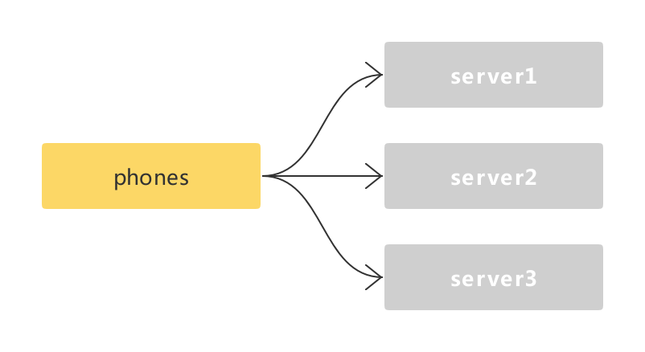
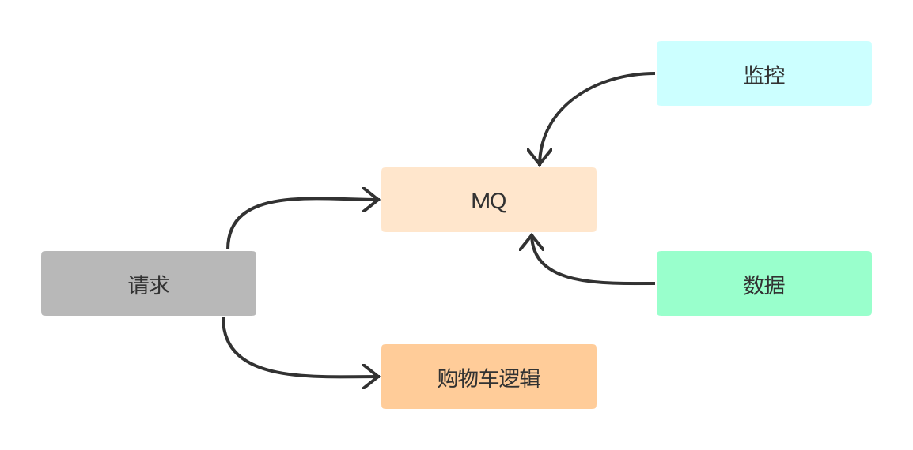
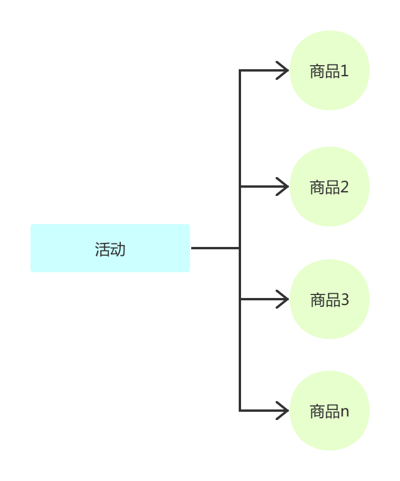
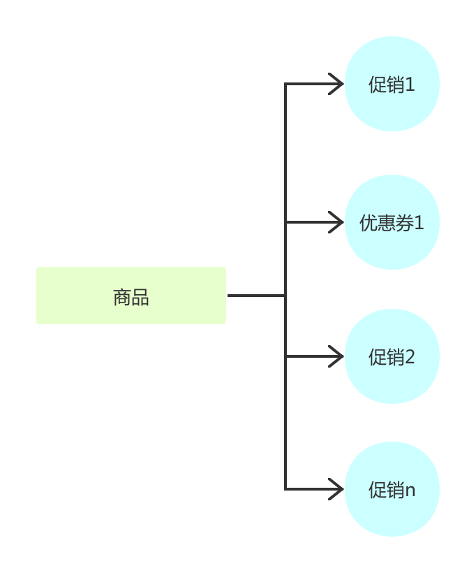

对于一个电商来讲，购物车是整个购买流程最重要的一步。因为电商发展到今天购物车不仅仅只是为了完成打包下单的功能；也是收藏、对比、促销提醒、相关推荐的重要展示窗口。如此多的能力我们该如何设计保证购物车的高性能、以及良好的扩展能力来满足未来的发展呢？

今天开始我们就以一个假定的场景来输出一个购物车设计：某某电商平台，是一个多租户模式（我们前面的诸多设计都是多租户模式），用户可以把商品加入到购物车，并切按照商户纬度来展示、排序。当然购物车也支持常规的各种操作：选择、删除、清空、商品失效等。并且有相关的促销能够提醒用户。同时为了监控、运营，要支撑购物车数据同步到监控、数仓等能力。

本文会从用户使用的角度以及服务端两个角度来讲解系统的能力。本篇我们的主要目的是说清楚购物车的能力以及一些逻辑。下一篇会进行购物车模型设计以及接口定义。

# 用户视角

我们先来定义一下在用户侧用户操作购物车的功能有哪些？

一个购物车基本的能力基本上都在上图中，下面我们一一来分解。

## 操作

我们从用户的角度来看，购物车对于用户来说可以添加商品到购物车（加购物车、立即购买都属于一种添加方式）；加入进购物车后，不想要了可以删除该商品（删一个、删多个、清空）；想多买可以修改购买数量，发现钱不够可以减少购买数量；或者发现红色的比白色更漂亮，可以在购物车方便的进行更换规格；对于一些价格很贵的商品，能够在购物车添加一些保障服务（其实是绑定的虚拟商品）；在要去结算的时候，还会提供选择能力让用户决定哪些商品真的本次要购买。

通过上面的描述我们可以看到这个过程是有其内在联系的。这里说一下关于选中功能，业界有两种做法，各有优劣，我们来看一下。淘宝的产品选中状态是保存在客户端的，并且默认不选中，刷新、重新打开APP状态会消失；京东、苏宁这一类是保存在服务端，会记录用户选中状态。针对这两种情况各有优劣。

**客户端：**

1. 性能，选中/不选中的逻辑直接放在本地做，减少网络请求
2. 体验，多端不能同步，但是购物车相对来说更像是一个收藏夹，每次用户自己选择也无可厚非
3. 计算，价格计算时需要上传本地选中商品（也可以本地计算）
4. 实现，主要靠客户端实现，与服务端无关，研发解耦合

**服务端：**

1. 性能，每次操作选中都需要调用服务端，而该操作可能很频繁，除了网络损耗，服务端也需要考虑该如何快速找到修改的商品
2. 体验，多端同步状态，记录历史状态
3. 计算，服务端可获取数据，请求时无须上传额外数据
4. 实现，服务端与客户端需要商定如何交互，以及返回数据（每次选中会导致价格变化），耦合再一起

个人认为这两种方式并无谁具备明显优势，完全是一种基于业务模式以及团队情况来做选择。我们这里后续的设计会基于在服务端保存商品选中状态。

在整个操作逻辑中，有个两个比较重要的地方单独说明一下：购买方式与购物车内修改购买属性

### 购买方式

主要的购买方式有立即购买、加入购物车、拼团购两种方式。

首先普通的加入购物车没什么太多要说的。重点来看下立即购买与拼团。

立即购买在于操作上来说就是选择商品后直接到了订单确认页面，没有购物车中去结算这一步。但是它的实现确可以依赖购物车的逻辑来做，我们来看一下使用购物车与不使用购物车实现这个逻辑有什么差别？

如果使用购物车来实现，也就是用户点击立即购买时，商品本质上还是加入到购物车中，但这个购物车却与原型的购物车不同，因为该购物车只能加一个商品，并且每次操作都会被覆盖。在视角效果上也是直接从商品详情页面跳转到订单确认页面。来看看这种方式的好处

1. 与购物车在订单确认、下单逻辑上一致，内部可以直接通过购物车获取数据
2. 需要一个独立的专门用于一键购买的购物车来实现，内存有消耗

另外一种实现方式使用一个新的数据结构，因为一般来说一键购买更简单，它只需要商品信息、价格信息即可。每次交互均可以根据sku_id来获取。

1. 订单确认、下单逻辑上需要进行改造，每次请求之间要传递约定参数
2. 节省内存，上下交互通过sku_id来保证

我们会采用使用在服务端一键购买以独立的购物车形式来实现。购物车的数据模型一致，保证了后续处理流程上的一致。

对于拼团，他其实分为两部分，首先先发团这个信息，当团成立后。我们可以选择将成团的商品加入普通购物车，同时可以加够其它商品。也可以选择将成团商品加入一键购买的购物车，保证成团商品只能买一个。拼团模式更像是加入购物车的一个前置条件。本质上它对于购物车的设计没有影响。

### 购物车内修改购买属性

这里主要是指可以在购物车便捷的操作一些需要在spu纬度操作的事情，比如：变更规格（也就是更换sku），以及选择绑定到spu纬度的服务（保险、延保等）。

我们重点说一下选择绑定的服务。例如：我们买一个手机，厂家提供了延保、各种其它附加服务，一般情况这种服务都是虚拟商品。但是这有个特殊情况。这些保障服务首先不能单独购买，其次他是跟主商品的数量息息相关。比如买两个手机，如果选择了加够服务，那么这些服务的数量必须是2，这会是一个联动关系。

这些保障服务是不能进行单独购买的，它一定要跟特定的商品捆绑销售。

服务端在存储这部分数据时一定需要考虑如何保存这种层级关系，这部分我们后面模型设计的时候大家会看到。

## 提醒

促销提醒很简单，返回的购物车数据，每一个商品应该携带当前的促销信息。这部分重点在于怎么获取促销信息，会在服务端看到。

然后说下购物车数量的提醒，也就是显示当前购物车商品的数量。一般来说进入到APP就会调用一个接口，获取用户的未读消息数、购物车商品数等。这里是需要非常高的读取速度。那么这种需求该如何满足呢？

**方案一：** 我们可以设计一个结构保存了用户相关的这种提醒信息数量，每次直接读取这个数据即可。不需要去跟消息服务、购物车服务打交道拿这些数据。

**方案二：** 在消息、购物车的模型中均设计一个保存总数量的字段，在读取数据的接口中，通过并发的方式调用这些服务拿到数据后进行聚合，这样在速度上只取决于最慢的服务。

这里我们的设计会采用 **方案二**，因为这样在某种程度上效率可以得到保证，同时整个系统的结构数据的一致性更容易得到保障。当然这里有个系统一定要注意，并发读取一定要设计超时，不要因为某个服务读数问题而导致拖累整个接口的性能。

接下来再来看看促销，这部分除了提醒，还需要提供对应的入口，让用户完成促销的操作。比如说某个商品有券，那么可以直接提供入口去领取；可凑单，有入口进入凑单列表并选择商品等。这部分需要解决的问题是服务端该如何及时从商品纬度拿到这些促销活动。

从用户的视角看完了，我们再来站在研发的角度看看服务端有哪些事情要做

# 研发视角

还是先来看看需求的汇总图：

## 存储

对于存储，首选肯定是内存存储，至于要不要落库，我觉得没有必要。说下我的理由：

1. 购物车的数据相对变化非常频繁，落库成本比较高，如果异步方式落库，很难保障一致性
2. 极端情况，cache奔溃了，仅仅需要用户重新加入购物车，并且我们可以通过cache的持久化机制来保证数据的恢复

所以对于购物车，我们只会把数据完全保存在内存中。

## 商品销售类型发生变化

现在我们来讨论 **商品销售类型发生变化** 这个问题。这是什么意思呢？大家想一下：比如我把A商品加入到购物车，但是一直没有结算。这时运营说针对A商品搞一个活动，拿出10个库存5折购。那么问题来了，对于之前购物车中就有该商品的用户该如何处理？**这里解决的主要问题是：购物车有该商品的用户不能直接以5折买**。几种方案，我们来看一下：

**方案一：** 促销配置后，所有购物车中有该商品的用户失效或删除，这个方案首先被pass，操作成本太高，并且用户体验差

**方案二：** 购物车中要区分同一个SKU，不同销售类型。也就是说在我们的购物车中不是按照SKU的纬度来加商品，而是通过 **SKU+售卖类型** 来生成一个唯一识别码。

可以看到 **方案二** 解决了同一个sku在购物车并存的问题，并且库存之前互相不影响。不过这里又有一个问题？商品的售卖类型（或者说这个标记），该怎么什么地方设置？好像商品系统可以设计、促销系统也可以设置。我们的逻辑中会在促销系统中进行配置。因为商品属于基础逻辑，如果一改就是全局库存受到影响。活动结束后很难做到自动正常售卖。因此这个标记应该落到活动中进行设置（活动设置时会通过促销系统获取该商品之前的活动是否互斥，以确保配置的活动不会互相矛盾）。

## 依赖系统

购物车系统依赖了非常多的其它系统。

- 购物车监控
- 数据分析
- 商品系统
- 库存系统
- 促销系统
- 结算系统

这些依赖的系统，有的是为了传输数据，有的是为了获取数据。我们按照这两个纬度来看一下。

### 购物车与数据分析

为了完成监控与数据分析，我们必须找到一种解决办法把数据发送给监控系统与数据分析系统。当然也可以推拉结合的方式。但是由于购物车的数据是用户纬度的，如果主动拉取需要有机制来告知对方系统数据发生变化。或者每次全量拉去，这都不是优雅的方式。

确定了采用推的方式交互数据，接下来是怎么推的问题。同步还是异步？

我推荐的一种做法是：购物车数据被服务端接受后，完成业务逻辑就直接返回，通过一个 **goroutine** 写入到MQ，监控与数据服务通过订阅消息来写入到自己存储中。

### 促销提醒与计算

还剩下服务端要解决的是促销的提醒与价格计算问题。

现来说计算，针对这部分最佳的方式是，调用结算中心的价格计算。我们来看一下购物车中的价格计算与订单结算时的价格计算的差异。

首先购物车中计算价格时不知道用户的地址，这会影响运费的计算；再是不知道用券的情况。那么其实如果解决了这两个问题，我们就可以让价格计算出自同一个逻辑，仅仅是部分入参不同罢了。因此我们这里计算时可以按照最高运费来计算，同时用券默认在购物车都不使用券。对于促销问题这里是可以通过促销系统确认选中的商品可以享受哪些价格的。因此促销的价格应该计算在内。

接下来在再来说说如何为用户高效的提供促销的信息。先从我们的配置夜视出发。

我们在配置一个促销活动或者发一张券时，都是将多个商品归到一个促销活动或者券的下面。如果按照活动、券的纬度来获取商品效率相对比较高。

但是在购物车的场景中发生了一个变化。我们是需要从商品纬度获取到该商品的所有活动信息（全平台活动、店铺活动）；
那么购物车中为了展示这些信息该怎么做？很常规的一个做法（也确实不少公司是这样）：把所有活动信息取出来，遍历出所有跟该商品相关的信息。这种做法效率很低，并且无法满足大规模的应用场景，比如双十一期间。

因此这里为了满足该需求，促销系统需要提供一个能力按照商品获取对应促销（活动、券）。因此一般来讲促销系统配置的活动不能仅仅是按照活动纬度存储，同时还需要生成一份商品纬度的促销信息。

## 失效与排序

还有两个小部分没有讲到，一是商品该如何失效，比如：库存没有了、下架了；二是购物车中的商品是多个店铺的，排序的策略是什么？

由于本文我们还只是讨论需求，不涉及具体的模型设计，因此只是介绍方案。首先是商品失效，这很像一个软删除操作，一旦设置，用户侧看到的商品将是无法进行结算的，只能进行删除操作。

对于排序我们会采用的设计是：根据某个店铺在购物车中最后发生操作的时间，最新的操作肯定在最上面。

# 结尾

通过上面我们基本上搞清楚了购物车设计中我们要做什么，依赖的系统要提供什么能力。下篇开始进入数据模型的设计、前后端接口设计。

如果你对购物车上面的需求还有哪些补充，欢迎留言。我们一起来完善。